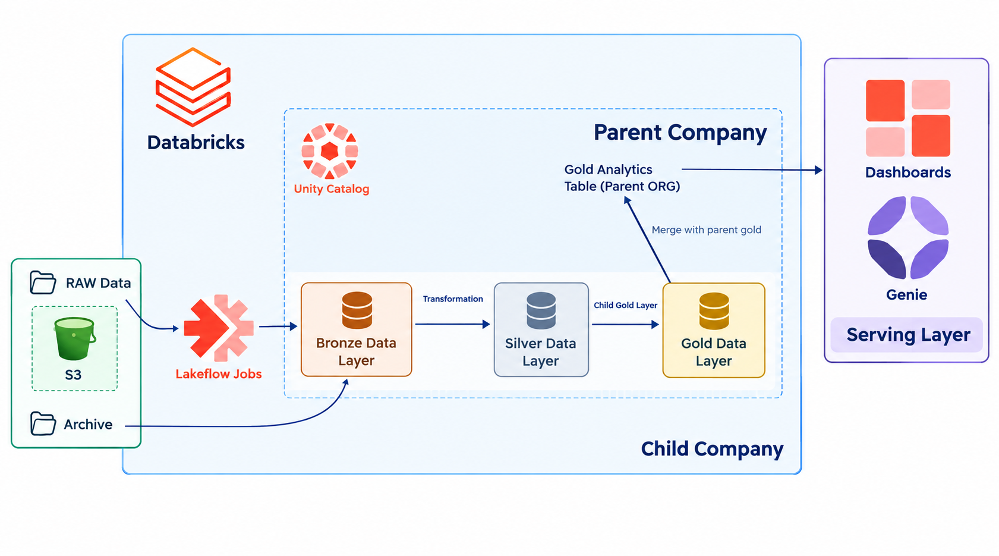
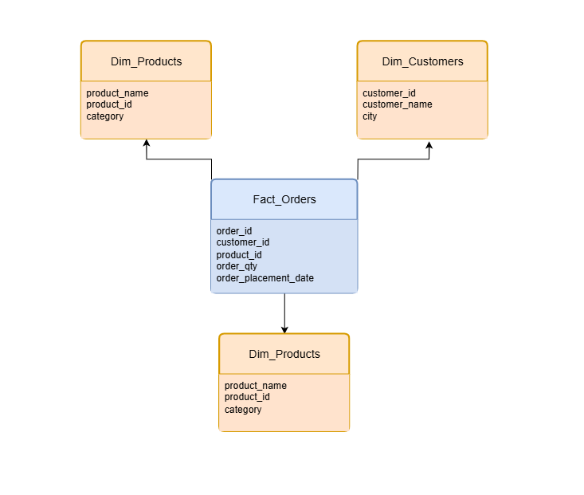
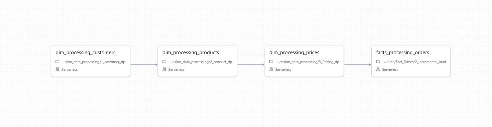

# Sports FMCG Data Engineering Pipeline

A Databricks-based data engineering project that builds a scalable and reliable data platform for a sports FMCG business after the acquisition of an energy nutrition company.

---

## Project Overview

### Business Background

AthliCon Sports is a global company operating across the sports and fitness industry. It recently acquired FuelEdge Nutrition, a fast-growing business specializing in energy bars and sports nutrition products.

Before the acquisition, both companies managed their data independently. AthliCon Sports had relatively structured and consistent ERP-based data, while FuelEdge Nutrition had data coming from multiple sources with different formats and reporting practices.

As the businesses started operating together, several data challenges appeared:

- Different data formats between the two companies
- Inconsistent reporting structures
- Missing historical data
- Different data processing requirements
- Separate customer, product, pricing, and order information
- Difficulty combining full-load and incremental data
- Inconsistent sales metrics
- Lack of a centralized analytical data layer

These problems made it difficult for management to obtain reliable sales insights and plan inventory and supply-chain operations.

The goal of this project is to build a centralized and scalable data engineering pipeline that integrates data from both companies and prepares it for analytics and reporting.

### Business Problem

The organization needs a reliable data platform that can:

1. Integrate data from the parent and acquired companies
2. Handle both historical and incremental data
3. Standardize data from different sources
4. Process customer, product, pricing, and order information
5. Build reusable dimension and fact tables
6. Create a centralized analytical data layer
7. Support reliable sales reporting and business analysis
8. Provide data that can be consumed by dashboards and reporting tools

---

## Solution

1. Data comes from an OLTP source and is stored raw in an AWS S3 bucket.
2. Databricks Lakeflow Jobs carry the data into the Medallion Architecture, starting with the **Bronze** layer.
3. The **Silver** layer resolves data inconsistencies and performs data transformation.
4. The **Gold** layer is built for the child company, then merged into the parent Gold layer.
5. The serving layer is the **Performance Dashboard**.
6. For the daily incremental load, a Databricks Jobs pipeline is scheduled to run daily at a fixed time.

---

## Data

The project contains data for two business entities.

### Parent Company

- Customers
- Products
- Gross pricing
- Orders

### Child Company

The acquired FMCG company:

- Customers
- Products
- Gross pricing
- Orders
- Historical order data
- Incremental order data

The project handles both:

- Full Load
- Incremental Load

---

## Project Architexture

## Project Data Model

## Job Pipeline

## Performance Dashboard

---

## Project Outcome

The project creates a centralized analytical data layer that brings together data from the parent and acquired FMCG businesses.

The resulting pipeline provides:

- Standardized business data
- Structured dimension and fact tables
- Support for incremental data
- Reusable analytical datasets
- A foundation for sales reporting
- A scalable approach for future data sources
